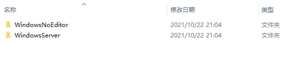

# Netshoot

## 简介

双人联机射击游戏，玩家需要在限定时间内击中尽可能多的飞行物体，计时结束后分数高者获胜


## 游戏演示视频及运行文件

https://pan.baidu.com/s/1mBijWno-fU4eSaaf3mIwBg 提取码：2048

## 运行方法

运行平台：windows10

1. 打开``ClientServerBuild``文件夹

   

2. 打开``WindowsServer``文件夹，双击运行``NetshootServer.exe - ServerWithSession``

   

3. 返回``ClientServerBuild``文件夹，打开``WindowsNoEditor``文件夹，双击运行``Netshoot.exe``，如果成功，则再重复运行一次

   

4. 成功后应该能看到两个客户端窗口和一个服务器控制台窗口

   

## 部分实现细节

### 移动物体的网络同步

定义移动物体的蓝图类为``FlyObject_BP``，游戏开始后，用于生成移动物体的蓝图类``SpawnFlyObject_BP``在指定位置初始化并生成移动物体，该过程仅在服务器端执行：


移动物体在初始化时，会获得一个随机速度和最大移动距离，之后，该物体只会在服务端执行移动脚本，客户端不会执行任何移动代码：

```c++
void AFlyObject::Tick(float DeltaTime)
{
	Super::Tick(DeltaTime);

	if(GetLocalRole() == ROLE_Authority)
	{
		auto deltaDist = DeltaTime * fMoveSpeed;
		SetActorLocation(GetActorLocation() + FVector(0.f, 0.f, Dir * deltaDist));

		if(GetActorLocation().Z < fOrgZ - fMaxDist)
		{
			Dir = 1;
		}
		else if(GetActorLocation().Z > fOrgZ + fMaxDist)
		{
			Dir = -1;
		}
	}
}
```

为了将该物体同步到客户端，该Actor需要设置``replicates``属性同步变量，同时设置``Replicate Movement``属性，该属性能够让服务器端将移动物体的位置复制到客户端，以保证各个客户端的玩家看到的移动物体位置一致。

### 使用状态同步判定命中事件

玩家发射子弹后，需要判定子弹和移动物体的碰撞事件以为玩家计分，在本项目中，仅仅服务器端对碰撞事件的发生做出反应，即增加子弹所属的玩家分数，销毁子弹和移动物体。玩家分数被设置为``replicates``，会被服务器端复制到各个客户端，子弹和移动物体也都被设置了``replicates``属性，因此客户端的副本也会被正常销毁：


接下来就是让客户端知道子弹发生了碰撞并产生特效，这里将``Spawn Emitter``事件设置为``Multicast``的同步模式，在该模式下，所有客户端都会处理生成粒子的事件。

使用状态同步的缺点在于，所有的游戏逻辑都需要在服务端进行计算，并且网络流量消耗较大，而由于客户端的状态总是要慢于服务器端的状态，当网络较差时，可能出现玩家输入无法及时相应的情况，在处理碰撞事件时，也会产生视觉误差，例如客户端的子弹在未到达移动物体时就被销毁并产生粒子特效，该情况可以通过服务器端和客户端的数据差值进行一定程度的弥补。

### 计时器同步

由于玩家需要在特定时间内击中尽可能多的移动物件来获得高分，因此需要设计一个全局的计时器来计算剩余时间，毫无疑问，该计时器必须在服务器端进行计时并同步到各个客户端显示（当然也可以在客户端同时计时并显示，这样网络环境较差时也能够正确显示时间，但是权威的剩余时间依然在服务器端计算，并在同步到客户端时对客户端的数据进行纠正，防止玩家的作弊行为）。

本项目将计时器的功能放在``GameState``类中实现，因为该类管理游戏状态，并且在服务器端和各个客户端都有一个实例。计时器分3个阶段实现功能：游戏开始前，游戏计时中和和计时结束后。

在游戏开始前，服务器端的计时器会不断检查当前场上玩家的数目，该数目在``GameMode``中计算，当有一个玩家登录房间后，玩家数目加一。当计时器判断玩家数目超过1个之后（也可以设置成2个），便设置``bGameStart``为``true``，开始计时，蓝图实现如下：


计时结束后，服务器端需要将每个玩家的最后分数汇总起来发送给客户端，每个客户端再将分数显示在结算面板上，其中，每个玩家的分数存储在各个玩家的``PlayerController``中，而``GameState``中存储了所有玩家的``PlayerController``引用，因此，服务器端通过``GameState``获取所有``PlayerController``后，调用``ClientGameEnd``事件，并将这些引用传递给客户端，该事件被设置为``multicast``同步模式，因此每个客户端都需要执行该事件，服务器端的蓝图实现如下：


之后客户端执行事件委托，将``PlayerController``中的玩家姓名和对应分数读取出来，并更新绑定在控件上的字符变量，最后显示结算面板：

